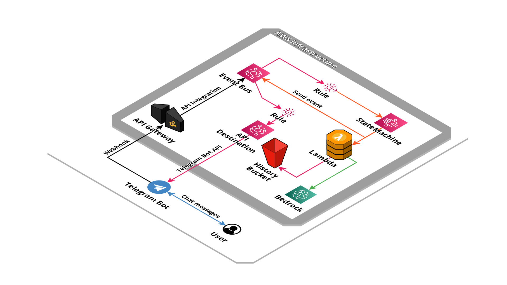

# AWS Serverless Telegram Bot for Bedrock


This is a serverless application that implements a Telegram bot connector for Amazon Bedrock.

## Created resources

This application create an API Gateway endpoint to listen for webhook request, an Event Bridge bus to send received messages.



## Installation

Using the [SAM CLI](https://docs.aws.amazon.com/serverless-application-model/latest/developerguide/what-is-sam.html):
```bash
sam build
sam deploy --guided
```

## Parameters

- **TelegramBotToken**: Telegram bot token.

- **TelegramIPsWhitelist**: Comma separate list of IPs of permitted senders IP, leave empty to disable whitelist.

- **UsernameWhitelist**: Telegram allowed usernames, separated by comma.

- **ModelId**: Model identifier (default: ai21.j2-mid-v1).

- **SystemPrompt**: Model instruction about how to respond to incoming messages.

## Outputs

- **WebhookEndpoint**: The Telegram bot Webhook URL

- **EventBusName**: Name of EventBridge bus where message event are sent

## Credits

- Repository badges by [Shields.io](https://shields.io/)
- Infrastructure schema by [Cloudcraft](https://www.cloudcraft.co/)
